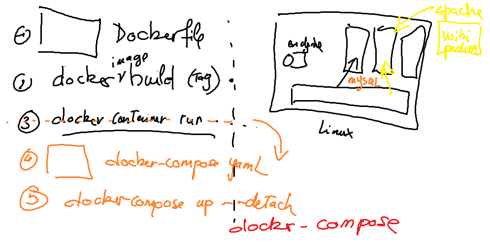

# :two: Compose

#### [:tada: Participation](.scripts/Participation.md)


## :gear: VM

- [ ] Se connecter à [Azure](https://github.com/CollegeBoreal/Tutoriels/tree/main/2.MicroServices/4.Cloud/2.Public/2.Azure)

- [ ] Créer les scripts 'terraform' en utilisant [boot](boot)

* crée un répertoire avec ton :id:

```
mkdir <ton ID>
```

* copie le répertoire `boot` dans ton répertoire :id:

```
cp -r boot <ton ID>
```

* aller dans le répertoire `boot` de son `:id:`

```
cd <ton ID>/boot
```

* éditer le code source `terraform` avec Visual Studio Code 

```
code .
```

* dans `main.tf` changer tous les noms comportants CB-AZ-300000000 avec CB-AZ-:id: 

- [ ] Créer sa machine virtuelle

* initialiser les modules et fournisseurs

```
terraform init
```

* créer la machine virtuelle

```
terraform apply
```

## :a: Docker Context

https://blog.mikesir87.io/2019/08/using-ssh-connections-in-docker-contexts/

- [ ] Set the `SSH` agent and key 

- [ ] Create the context

```
docker context create machine-CB-AZ-<ton ID> --docker "host=ssh://terraform@<ton IP>"
```

- [ ] Use the context 

```
docker context use machine-CB-AZ-<ton ID>
```

## :b: En utilisant la méthode imperative (via le CLI)

:one: Créer le réseau

```
docker network create wordpress-network
```

:two: Créer le volume (disque) pour la persistence de MariaDB et créer le container MariaDB

- [ ]  Créer le volume

```
docker volume create --name mariadb_data
```

- [ ]  Lancer le conteneur

```
docker container run \
  --name mariadb \
  --env ALLOW_EMPTY_PASSWORD=yes \
  --env MARIADB_USER=bn_wordpress \
  --env MARIADB_PASSWORD=bitnami \
  --env MARIADB_DATABASE=bitnami_wordpress \
  --volume mariadb_data:/bitnami/mariadb \
  --network wordpress-network \
  --detach \
  bitnami/mariadb:latest
```

:three: Creer les volumes pour la persistence de WordPress et lancer le conteneur

- [ ]  Créer le volume

```
docker volume create --name wordpress_data
```

- [ ]  Lancer le conteneur

```
docker container run --name wordpress \
  --publish 8080:8080 -p 8443:8443 \
  --env ALLOW_EMPTY_PASSWORD=yes \
  --env WORDPRESS_DATABASE_USER=bn_wordpress \
  --env WORDPRESS_DATABASE_PASSWORD=bitnami \
  --env WORDPRESS_DATABASE_NAME=bitnami_wordpress \
  --volume wordpress_data:/bitnami/wordpress \
  --network wordpress-network \
  --detach \
  bitnami/wordpress:latest
```

:four: Accéder à votre application WordPress

http://localhost.<mon-nom-de-domaine>


## :ab: En utilisant la méthode déclarative (via docker-compose)

:bulb: [Run the application using Docker Compose](https://github.com/bitnami/containers/tree/main/bitnami/wordpress#run-the-application-using-docker-compose)

- [ ] Dans votre repertoire :id:

    Creer un fichier `README.md` ou vous mettrez votre nom de domaine i.e. `wordpress.<nomd de domaine>`

- [ ] Chercher un fichier `docker-compose.yml` pour illustrer plusieurs containeurs sur un seul `noeud`.


Penser à `wordpress`, bien sûr vous pouvez utiliser cet example

https://docs.docker.com/samples/wordpress/
``
ou chercher avec Google en tapant dans la recherche

```
docker-compose yml example bitnami
```

- [ ] Copier le fichier `yaml` dans votre repertoire  

- [ ] Lancer la commande,

```
docker-compose up --detach
```


Bonne chance



