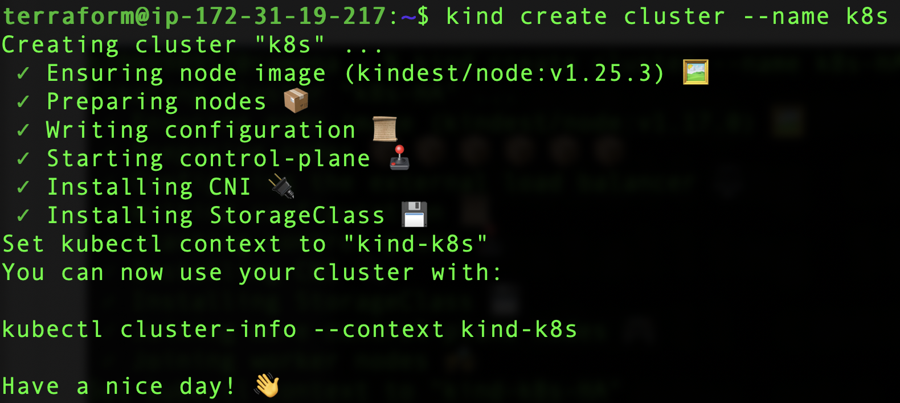
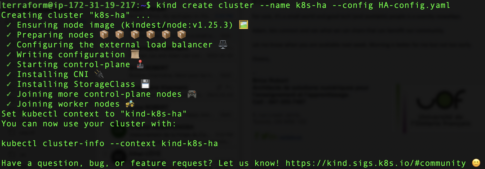
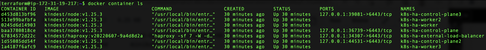

# KIND - Kubernetes In Docker


# :warning: Tries to install Docker-Desktop (on Windows Server)

| Docker Engine | Windows | Linux | 
|---------------|---------|-------|
| kind          | :heavy_check_mark: | :heavy_check_mark: |


## :o: Install 

#### :round_pushpin: KIND

:desktop_computer: Windows

```
choco install kind
```

:apple: MacOS

```
brew install kind
```

:penguin: Ubuntu

```
curl -Lo ./kind https://kind.sigs.k8s.io/dl/v0.17.0/kind-linux-amd64
chmod +x ./kind
sudo mv ./kind /usr/local/bin/kind
```

#### :round_pushpin: kubectl (kube control)

:desktop_computer: Windows

```
choco install kubectl
```

:apple: MacOS

```
brew install kubectl
```

:penguin: Ubuntu

```
snap install kubectl
```


## :a: Run single node


```
kind create cluster --name k8s
```

</img>

- [ ] Get contexts

```
kubectl config get-contexts   
```
> Outputs :
<pre>
CURRENT   NAME       CLUSTER    AUTHINFO   NAMESPACE
*         kind-k8s   kind-k8s   kind-k8s   
</pre>

- [ ] Use contexts

```
$ kubectl config use-context kind-k8s
```

## :b: Run multiple nodes

- [ ] Create a folder with your :id:

:pushpin: in youo :id: folder, edit file `HA-config.yaml`

```yaml
# HA-config.yaml
kind: Cluster
apiVersion: kind.x-k8s.io/v1alpha4
nodes:
- role: control-plane
- role: control-plane
- role: control-plane
- role: worker
- role: worker
- role: worker
```

:pushpin: Run the cluster

```
kind create cluster --name k8s-ha --config HA-config.yaml 
```

</img>

```
kubectl config get-contexts                              
```
> Outputs :
<pre>
CURRENT   NAME          CLUSTER       AUTHINFO      NAMESPACE
          kind-k8s      kind-k8s      kind-k8s      
*         kind-k8s-ha   kind-k8s-ha   kind-k8s-ha
</pre>

</img>

```
% kubectl get nodes                     
NAME                    STATUS   ROLES    AGE   VERSION
k8s-ha-control-plane    Ready    master   17m   v1.17.0
k8s-ha-control-plane2   Ready    master   17m   v1.17.0
k8s-ha-control-plane3   Ready    master   16m   v1.17.0
k8s-ha-worker           Ready    <none>   15m   v1.17.0
k8s-ha-worker2          Ready    <none>   15m   v1.17.0
k8s-ha-worker3          Ready    <none>   15m   v1.17.0
```

## :x: Remove Cluster

```
% kind delete cluster --name k8s
```

```
% kubectl config get-contexts                              
CURRENT   NAME          CLUSTER       AUTHINFO      NAMESPACE
*         kind-k8s-HA   kind-k8s-HA   kind-k8s-HA   
          minikube      minikube      minikube   
```

## :x: Force removing if issues

```
% rm ~/.kube/config
```

```
% docker rm -f `docker container ls -q`
```

# References

- [ ] [Quick Start](https://kind.sigs.k8s.io/docs/user/quick-start/)
- [ ] [Launching Remote KIND (Kubernetes in Docker) Clusters](https://www.mendrugory.com/post/remote-kind)
