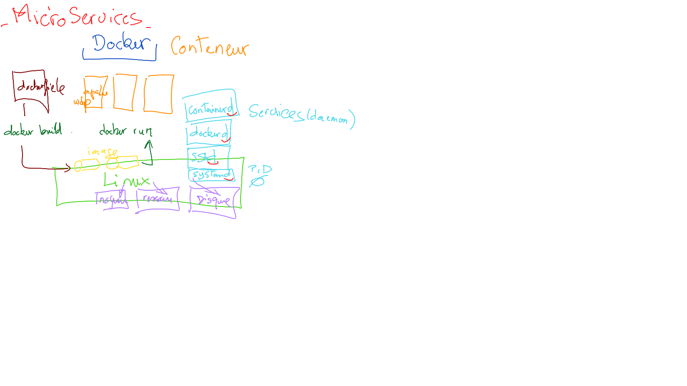
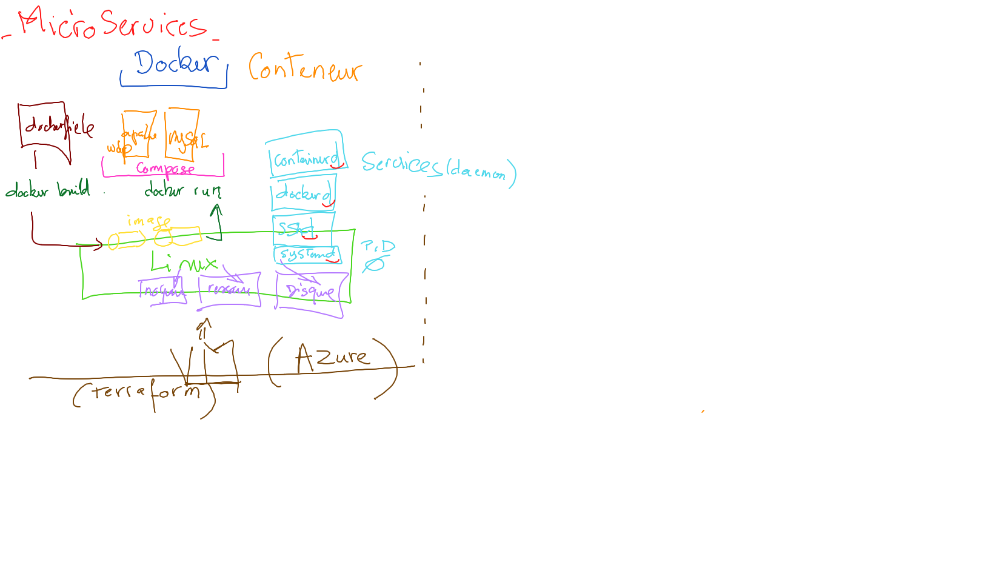
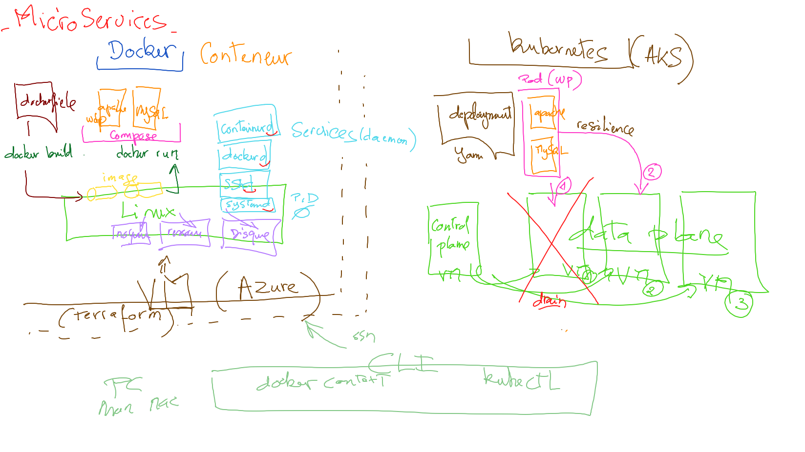

# :four: Azure [AKS](https://azure.microsoft.com/services/kubernetes-service)

[:tada: Participation](.scripts/Participation.md)

## :gear: Installation

Sur votre PC:

:round_pushpin: Installer [kubectl](https://github.com/CollegeBoreal/Tutoriels/blob/main/2.MicroServices/3.Orchestration/1.Kubernetes/README.md#a-kubectl-client)

:round_pushpin: Installer [Lens](https://github.com/CollegeBoreal/Tutoriels/blob/main/2.MicroServices/3.Orchestration/1.Kubernetes/README.md#star-ide)

- [ ] Se connecter avec [Azure CLI](https://github.com/CollegeBoreal/Tutoriels/tree/main/2.MicroServices/4.Cloud/2.Public/2.Azure/cli)

- [ ] Créer les scripts 'terraform' en utilisant [boot](boot)

* crée un répertoire avec ton :id:

```
mkdir <ton ID>
```

* copie le répertoire `boot` dans ton répertoire :id:

```
cp -r boot <ton ID>
```

* aller dans le répertoire `boot` de son :id:

```
cd <ton ID>/boot
```

* éditer le code source `terraform` avec Visual Studio Code 

```
code .
```

* dans `main.tf` changer tous les noms comportants AKS-CB-AZ-300000000 avec CB-AZ-:id: 
* dans `output.tf` changer tous les noms comportants AKS-CB-AZ-300000000 avec CB-AZ-:id: 

## :a: Création de la grappe :wheel_of_dharma: sur Azure

À partir de votre PC, créer une grappe sur:

:round_pushpin: [Azure](boot) dans le nuage

## :b: Installer votre application 

- [ ] Utiliser Lens pour installer votre application

- [ ] Créer un répertoire avec votre :id: et y mettre un fichier `README.md` 

- [ ] Mettre une image montrant votre grappe dans Lens (plus il y a d'images et de textes mieux ce sera)


## :ab: .kube/config et TLD

- [ ] Créer un répertoire `.kube`

- [ ] Y mettre le fichier `config` de votre grappe

## :cl: IP et Domaine

- [ ] Démontrer l'adresse IP de votre `service` Kubernetes (si disponible)
- [ ] Ajouter la grappe AKS à votre nom de domaine et démontrer que votre grappe tourne sous le nom de domaine





