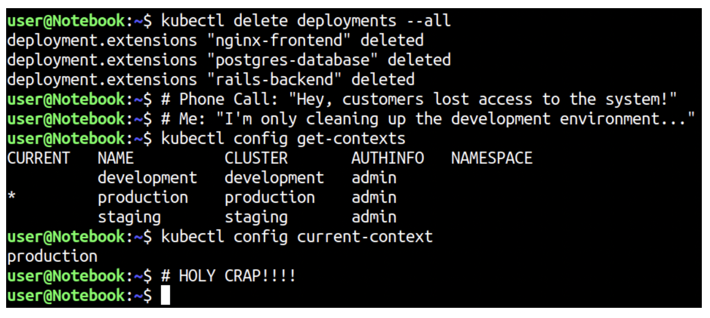

# :card_index: Contexte

Le fichier de configuration `$KUBECONFIG=$HOME/.kube/config` encapsule les caractéristiques de la grappe, les certificats :closed_lock_with_key: correspondants, les clés privés :key: ainsi que les informations sur l'administrateur. 

</img>

## :o2: Fichier de configuration

:round_pushpin: Copier le fichier :ice_cube: `kube` config sur son PC

- [ ] Créer le répertoire caché de configuration `kubernetes`

```
$ mkdir -p $HOME/.kube
```

- [ ] s'assurer d'avoir une connexion privilégiée avec une clé privée `~/.ssh/myprivate-key.pk` ayant accès au plan de contrôle.

- [ ] Fournir le nom de domaine du plan de contrôle i.e. `ubuntu@betelgeuse.orion.gasy.africa`

- [ ] Copier le fichier de configuration `config` dans le répertoire `$HOME/.kube`

```
scp -i ~/.ssh/myprivate-key.pk ubuntu@betelgeuse.orion.gasy.africa:.kube/config ~/.kube/config
```

- [ ] Visualisation des contexts de connexion aux grappes `Kubernetes`

```
$ kubectl config get-contexts
CURRENT   NAME                          CLUSTER      AUTHINFO           NAMESPACE
*         kubernetes-admin@kubernetes   kubernetes   kubernetes-admin   
```

La grappe `kubernetes`, ayant comme nom de contexte `kubernetes-admin@kubernetes` est affichée

## :cl: Sauvegarde du contexte

Sauvegarder le fichier de configuration de contexte sur github dans votre nom de grappe.

- [ ] Créer un répertoire `.kube` sous votre grappe dans le projet

```
$ mkdir <LE NOM DE MA GRAPPE>/.kube
$ cp ~/.kube/config <LE NOM DE MA GRAPPE>/.kube
```

- [ ] Sauver dans github

```
$ git add et tralala
```

[:back:](../#joystick-contrôller-la-grappe)

# References

https://faun.pub/using-different-kubectl-versions-with-multiple-kubernetes-clusters-a3ad8707b87b

https://serverfault.com/questions/1001257/kubernetes-rename-cluster
