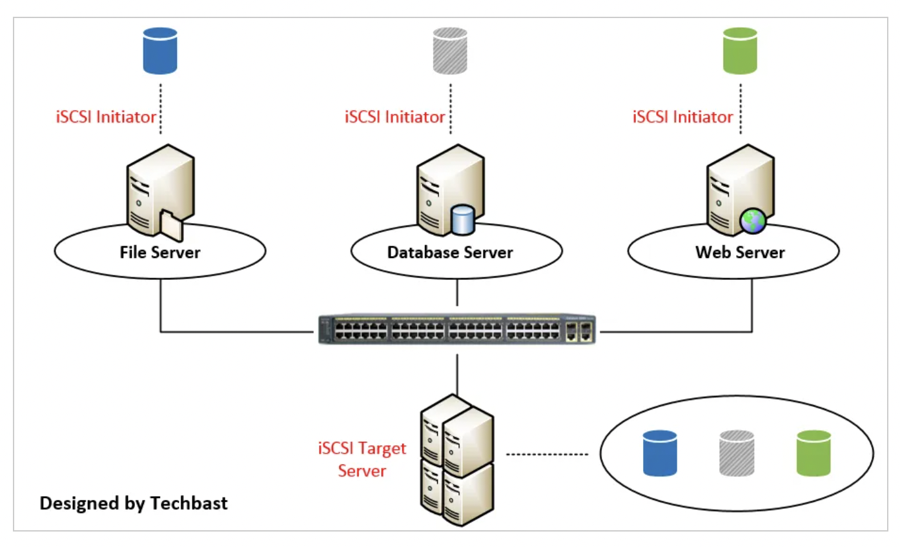

# :minidisc: Service [iSCSI](http://www.open-iscsi.com)

</img>

## :a: Vérifier la présence du fichier de configuration `iscsi` 

```
sudo cat /etc/iscsi/initiatorname.iscsi
```
> Retourne :
```yaml
[sudo] password for ubuntu: 
## DO NOT EDIT OR REMOVE THIS FILE!
## If you remove this file, the iSCSI daemon will not start.
## If you change the InitiatorName, existing access control lists
## may reject this initiator.  The InitiatorName must be unique
## for each iSCSI initiator.  Do NOT duplicate iSCSI InitiatorNames.
InitiatorName=iqn.1993-08.org.debian:01:a4b5157f8afe
```

:bulb: si le fichier `ìnitiator` n'est pas présent, installer `open-iscsi`:

```
sudo apt-get update && sudo apt-get install open-iscsi
```

## :b: Vérifier que le service `iscsid` est disponible

:warning: Printout below shows `disabled` 

```
systemctl status iscsid 
```
> Retourne
```
● iscsid.service - iSCSI initiator daemon (iscsid)
     Loaded: loaded (/lib/systemd/system/iscsid.service; disabled; vendor preset: enabled)
     Active: inactive (dead)
TriggeredBy: ● iscsid.socket
       Docs: man:iscsid(8)
```

- [ ] Démarrer le service `iscsid`

```
sudo systemctl enable --now iscsid
```
> Retourne
```
Synchronizing state of iscsid.service with SysV service script with /lib/systemd/systemd-sysv-install.
Executing: /lib/systemd/systemd-sysv-install enable iscsid
Created symlink /etc/systemd/system/sysinit.target.wants/iscsid.service → /lib/systemd/system/iscsid.service.
```

- [ ] Vérifier qu'il est démarré et en marche `active (running)`

```
systemctl status iscsid 
```
> Retourne
```yaml
● iscsid.service - iSCSI initiator daemon (iscsid)
     Loaded: loaded (/lib/systemd/system/iscsid.service; enabled; vendor preset: enabled)
     Active: active (running) since Tue 2023-04-11 01:33:16 UTC; 4s ago
TriggeredBy: ● iscsid.socket
       Docs: man:iscsid(8)
    Process: 100206 ExecStartPre=/lib/open-iscsi/startup-checks.sh (code=exited, status=0/SUCCESS)
    Process: 100209 ExecStart=/sbin/iscsid (code=exited, status=0/SUCCESS)
   Main PID: 100211 (iscsid)
      Tasks: 2 (limit: 77134)
     Memory: 3.5M
        CPU: 14ms
     CGroup: /system.slice/iscsid.service
             ├─100210 /sbin/iscsid
             └─100211 /sbin/iscsid

Apr 11 01:33:16 bellatrix systemd[1]: Starting iSCSI initiator daemon (iscsid)...
Apr 11 01:33:16 bellatrix iscsid[100209]: iSCSI logger with pid=100210 started!
Apr 11 01:33:16 bellatrix iscsid[100210]: iSCSI daemon with pid=100211 started!
Apr 11 01:33:16 bellatrix systemd[1]: Started iSCSI initiator daemon (iscsid).
```

[:back:](../#roll_of_paper-le-périphérique-block-device)

# References:

- [ ] [OpenEBS Install Prerequisites - Ubuntu](https://openebs.io/docs/user-guides/prerequisites#ubuntu)
- [ ] [Visio Stencils: Operation diagram of iSCSI Target Server](https://techbast.com/2019/06/visio-stencils-operation-diagram-of-iscsi-target-server.html)
