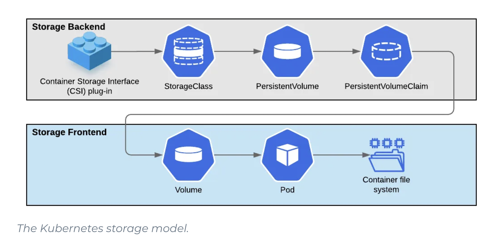

# :wheel_of_dharma: Kubernetes sur Métal

L'exercice dans cette section est de préparer sa grappe (cluster) que vous installerez sur du métal.

| :tada: Participation                                             |  Commentaires        |
|------------------------------------------------------------------|----------|
| [ :bust_in_silhouette: Individuelle ](.scripts/Participation.md) | Chaque étudiant.e doit effectuer des tâches sur leur serveur permettant la mise en marche de la grappe |
| [ :busts_in_silhouette: En groupe ](.scripts/Groupes.md)         | Chaque groupe mettra en oeuvre l'application de certaines tâches pour créer la grappe         |

## :book: Table des matières

| Chapitres                               | Descriptions                                                       |
|-----------------------------------------|--------------------------------------------------------------------|
| [:o2: Nommage](#o2-nommage)               | Constituer et nommer sa grappe                                     |
| [:a: La préparation](#a-la-préparation) | Préparer son noeud                                                 |
| [:b: Les composants](#b-les-composants) | Installer les composants constituant la grappe (outils et services)|
| [:ab: Les plans](#ab-les-plans)                                   | Déployer les plans `kubernetes` de contrôle et de données          |
| [:joystick: Contrôller la grappe](#joystick-contrôller-la-grappe) |  Contrôller la grappe à distance d'un poste d'utilisateur |
| [:floppy_disk: Le stockage ](#floppy_disk-le-stockage) | Stocker les données sur des disques synchronisés sur un réseau de stockage (SAN) |
| [:rocket: Les services](#rocket-les-services) | Permet de fournir les applications à travers des services |


## :o2: Nommage

:busts_in_silhouette: activité en groupe

Votre grappe comprend 4 noeuds (serveurs) que vous devrez d'abord nommer

- [ ] Nommer vos [Grappes](.doc/Grappes.md) :writing_hand:	 
- [ ] Aidez vous de Azure `Zone DNS` pour créer votre Zone aupres de votre fournisseur de domaine (NS Record).
- [ ] Après avoir déterminé le nom de votre grappe:

* Créer un répertoire avec le nom de votre grappe et y mettre un fichier `README.md` avec la topologie de votre grappe, example:

:star: Name: orion

| Type Server   | Hostname                     |  IP               | Specs                 |
|---------------|------------------------------|-------------------|-----------------------|
| control plane | betelgeuse.orion.gasy.africa | `10.13.15.200/20` | 64GB Ram,      16cpus |
| data plane    | bellatrix.orion.gasy.africa  | `10.13.15.201/20` | 64GB Ram,      16cpus |
| data plane    | rigel.orion.gasy.africa      | `10.13.15.202/20` | 32GB Ram,      16cpus |
| data plane    | saiph.orion.gasy.africa      | `10.13.15.203/20` | 64GB Ram,      16cpus |

## :a: La préparation

:bust_in_silhouette: activité individuelle

#### :round_pushpin: Le serveur

- [ ] son nom
- [ ] son `swap`
- [ ] son `bridge`

[Preparation](.doc/Preparation.md) :writing_hand:	


## :b: Les composants

:bust_in_silhouette: activité individuelle

</img>

#### :round_pushpin: Installation des outils

- [ ] Installer les outils [:ice_cube: kubetools](.doc/kube-tools.md) :writing_hand: permettant de gérer la grappe, comme `kubeadm` et `kubectl`

#### :round_pushpin: Installation des services

- [ ] Installer le [CNI](https://kubernetes.io/docs/concepts/cluster-administration/networking/) (Container Network Interface) géré par le Service [:droplet: Kubelet](.doc/kubelet.md) :writing_hand:	 

- [ ] Installer le [CRI](https://kubernetes.io/docs/setup/production-environment/container-runtimes/) (Container Runtime Interface) géré par le Service [:whale: Docker](.doc/docker.md) :writing_hand:	 défini par l'[OCI](https://opencontainers.org) ( :bulb: __À installer uniquement si Docker n'est pas déjà sur le serveur__ )

## :ab: Les plans

:busts_in_silhouette: activité en groupe

##### :control_knobs: Le plan de contrôle (control plane)

:warning: Assurez vous que votre domaine a tous les noms de serveurs (noeuds) liés à votre grappe

- [ ] Installer le [plan de contrôle](.doc/control-plane.md) :writing_hand:	 
- [ ] Initialiser le réseau de gousses (pod network) en utilisant le [CNI plugin](.doc/cni-plugin.md) :writing_hand: Calico

:star2: Mais qu'est-ce qu'un [manifeste](.doc/manifest.md) :writing_hand: ?

##### :abacus: Les plan de données (data plane)

- [ ] Permettre aux autres noeux de [joindre](.doc/data-plane.md) :writing_hand: la grappe.


## :joystick: Contrôller la grappe

:busts_in_silhouette: activité en groupe

:round_pushpin: Installer les [:toolbox: outils](.doc/kube-tools-pc.md) :writing_hand: sur son PC pour gérer la grappe

| outil     | Description          |
|-----------|----------------------|
| `kubectl` | Contrôller la grappe |
| :package: `helm`    | Gestionnaire de librairies (Package Manager) de Kubernetes |
| :level_slider: `lens`    | IDE permettant la gestion de Kubernetes |

:round_pushpin:  Mettre le fichier de `configuration` en contexte pour permettre la gestion de la grappe à distance

- [ ] Installer le fichier de configuration dans un [contexte](.doc/contexts.md) :writing_hand:	 `Kubernetes`

:round_pushpin:  Tester sa connexion à la grappe

- [ ] Vérifier que le context courant pointe bien sur `kubernetes-admin@kubernetes`

```
$ kubectl config get-contexts                                                      
CURRENT   NAME                          CLUSTER      AUTHINFO           NAMESPACE
*         kubernetes-admin@kubernetes   kubernetes   kubernetes-admin   
```

- [ ] Vérifier que la grappe est complète

```
$ kubectl get nodes
NAME         STATUS   ROLES    AGE     VERSION
bellatrix    Ready    <none>   3m15s   v1.26.3
betelgeuse   Ready    master   25m     v1.26.3
rigel        Ready    <none>   68s     v1.26.3
saiph        Ready    <none>   22s     v1.26.3
```

- [ ] Visualiser la grappe dans :level_slider: `Lens`

:warning: Attention à ne pas installer d'applications, il manque la partie stockage.

## :cl: La classe de stockage (Storage Class)

#### :roll_of_paper: Le périphérique (Block Device)

:bust_in_silhouette: activité individuelle à appliquer à partir des :abacus: plans de données: 

Le but de l'exercice est de créer un disque ou plutôt un volume logique et de le mettre en réseau avec `iSCSI`


- [ ] Installer le Service [:minidisc: iSCSI](.doc/iscsi.md) :writing_hand:	permettant une implémentation [SAN](https://en.wikipedia.org/wiki/Storage_area_network) du protocole d'[`open-iscsi`](http://www.open-iscsi.com/)
- [ ] Créer le volume logique [:cd: lvm](.doc/lvm.md) :writing_hand:	appellé `iscsi-lv`
- [ ] Préparer le [périphérique](.doc/blockdevice.md) en mode block et l'enregistrer dans un fichier `blockdevice-xxxx-xxx-xxx.md` du répertoire de votre grappe.

#### :floppy_disk: Le stockage 

[:bookmark: Container Storage](https://landscape.cncf.io/card-mode?category=cloud-native-storage&grouping=category)

:busts_in_silhouette: activité en groupe à appliquer à partir du :control_knobs: plan de contrôle: 

:round_pushpin: Le modèle de stockage de kubernetes 

</img>

Le standard Kubernetes permet aux founisseurs d'infrastructure d'utiliser leur propre moteur de stockage pour conteneur ou encore `CS` (Container Storage). Pour cela, la norme Kubernetes fournit une interface [CSI](https://kubernetes-csi.github.io/docs). Cette interface permet d'utiliser des [Polices](https://kubernetes-csi.github.io/docs/drivers.html) ou `Plugin` en fonction de l'environnement info-nuagique ou métal.

Dans notre environnement, nous allons choisir [openEBS](https://openebs.io) et son `Moteur de Stockage` [cStor](https://openebs.io/docs/user-guides/cstor) comme `CSI Plugin`

 </img>

:round_pushpin:  [Installer](.doc/openebs/install.md):pinching_hand: le `CSI Plugin` [openEBS](https://openebs.io)

:round_pushpin:  Créer la **classe de stockage (sc)** `standard` 

- [ ] Installer les périphériques préalablement définis ci-dessus 
- [ ] Créer d'un réservoir de stockage `pool` avec les :three: périphériques
- [ ] Créer la **classe de stockage (sc)** `standard` avec le réservoir de stockage `pool`

Utiliser les [operations d'administration](.doc/openebs/adminop.md):pinching_hand:. suivante pour la création de la  **classe de stockage (sc)** `standard`

:round_pushpin:  Vous pouvez maintenant utiliser la **classe de stockage (sc)** `standard` définie par `défaut`

:bulb: Vérifier que la classe de stockage par **défaut** est bien **standard**

```
$ kubectl get storageclasses        
NAME                        PROVISIONER                                                RECLAIMPOLICY   VOLUMEBINDINGMODE      ALLOWVOLUMEEXPANSION   AGE
openebs-device              openebs.io/local                                           Delete          WaitForFirstConsumer   false                  20h
openebs-hostpath            openebs.io/local                                           Delete          WaitForFirstConsumer   false                  20h
openebs-jiva-default        openebs.io/provisioner-iscsi                               Delete          Immediate              false                  20h
openebs-snapshot-promoter   volumesnapshot.external-storage.k8s.io/snapshot-promoter   Delete          Immediate              false                  20h
standard (default)          openebs.io/provisioner-iscsi                               Delete          Immediate              false                  48s
```


## :rocket: Les Services

[:bookmark: Service](https://kubernetes.io/fr/docs/concepts/services-networking/service/)


:busts_in_silhouette: activité en groupe

##### :control_knobs: Le plan de contrôle (control plane)

- [ ]  [Installer](.doc/openelb.md):pinching_hand: [openelb](https://openelb.io/). 

## :clapper: Les Applications

:bust_in_silhouette: activité individuelle

Chaque étudiant aura à installer son application dans la grappe

- [ ]  Installer les applications avec [LENS](https://k8slens.dev/)
- [ ] Activer :rocket: le service en appliquant les annotations reliés à l'équilibreur de charge `LoadBalancer` Porter en fonction des examples de [Configuration](https://github.com/CollegeBoreal/Tutoriels/tree/main/2.MicroServices/3.Orchestration/1.Kubernetes/C.Cluster/0.Local/6.K8s/apps) d'applications suivantes
- [ ] Attacher l'application à votre nom de domaine
