# D.Docker :whale:

## :bulb: Dockerfile

Quels sont les instructions pour créer sa propre image?

| Instructions |  Commentaires                                                                                                |
|--------------|--------------------------------------------------------------------------------------------------------------|
| `#`          | faire un commentaire                                                                                         |
| `FROM`       | Donner une image                                                                                             |
| `LABEL`      | Donner de l'information (i.e. `maintener=`)                                                                  |
| `ENV`        | permet de passer des variables d'environnements. Note: utiliser le paramêtre `--env` à la ligne de commande  |
| `WORKDIR`    | Comme `pwd` en Unix, indique le répertoire de travail ou courant                                             |
| `ADD`        | Ajoute des fichiers (compréssés) ou des répertoires à l'image                                                |
| `COPY`       | Ajoute des fichiers à l'image                                                                                |
| `RUN`        | Éxécute les scripts ou installe des librairies ( `apt-get` ou `pip` ) dans l'image                           |
| `ENTRYPOINT` | Par défaut éxécute à la fin de l'installation `["/bin/sh"]`. On peut l'`override` (outrepasser ou remplacer) |
| `CMD`        | Permet de rajouter des parametres à la commande `ENTRYPOINT` - de type tableaux [ "param1", "parma2"]        |

---

[Introduction to docker - 2017 Slides](https://www.slideshare.net/Docker/introduction-to-docker-2017)

## :tv: [Bienvenue dans docker pour les developpeurs](https://www.linkedin.com/learning/docker-pour-les-developpeurs/bienvenue-dans-docker-pour-les-developpeurs?u=56968449)

## Qu'est-ce que Docker?

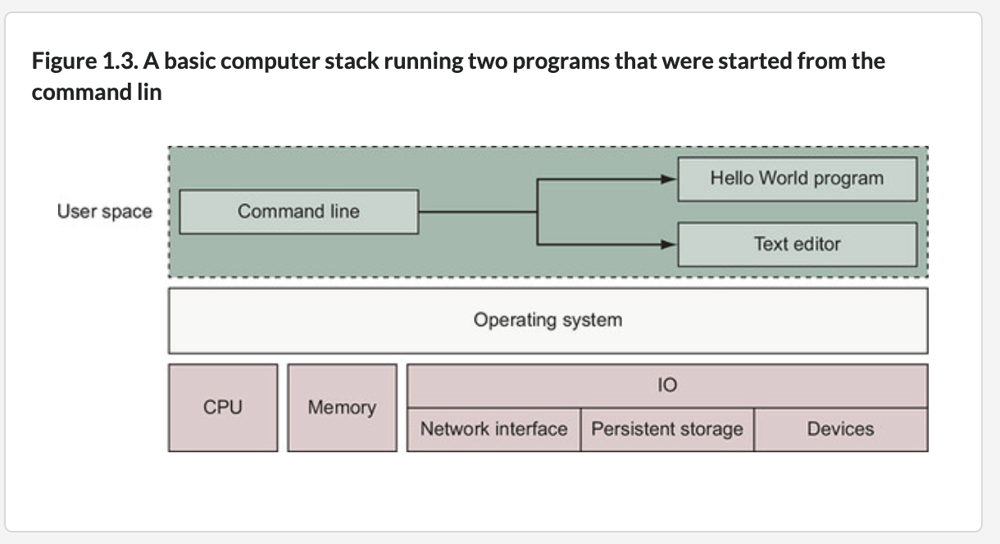</img>

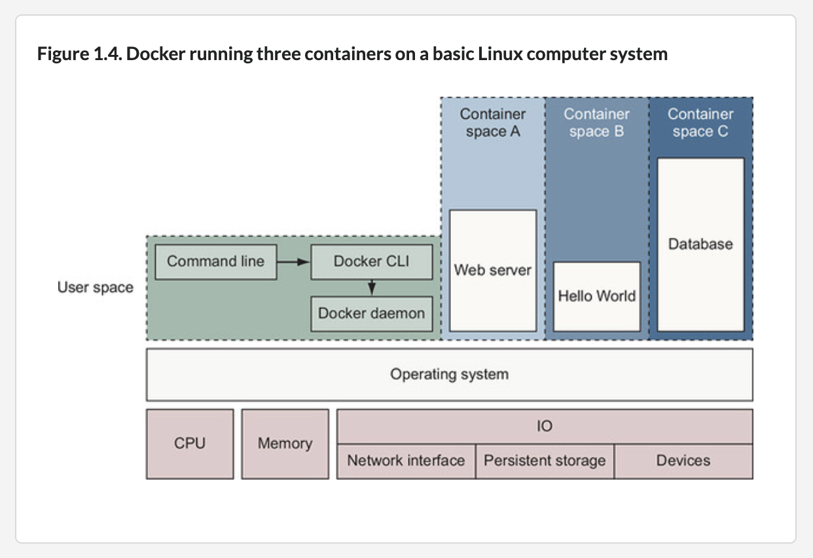</img>

## :tv: Vidéos de cours

- [ ] [Cycle de vie](https://www.linkedin.com/learning/decouvrir-docker/decouvrir-le-cycle-de-vie-d-un-conteneur?u=56968449)

- [ ] Composition d'une [Image](https://www.linkedin.com/learning/decouvrir-docker/comprendre-les-couches-d-une-image?u=56968449) `ISO` docker

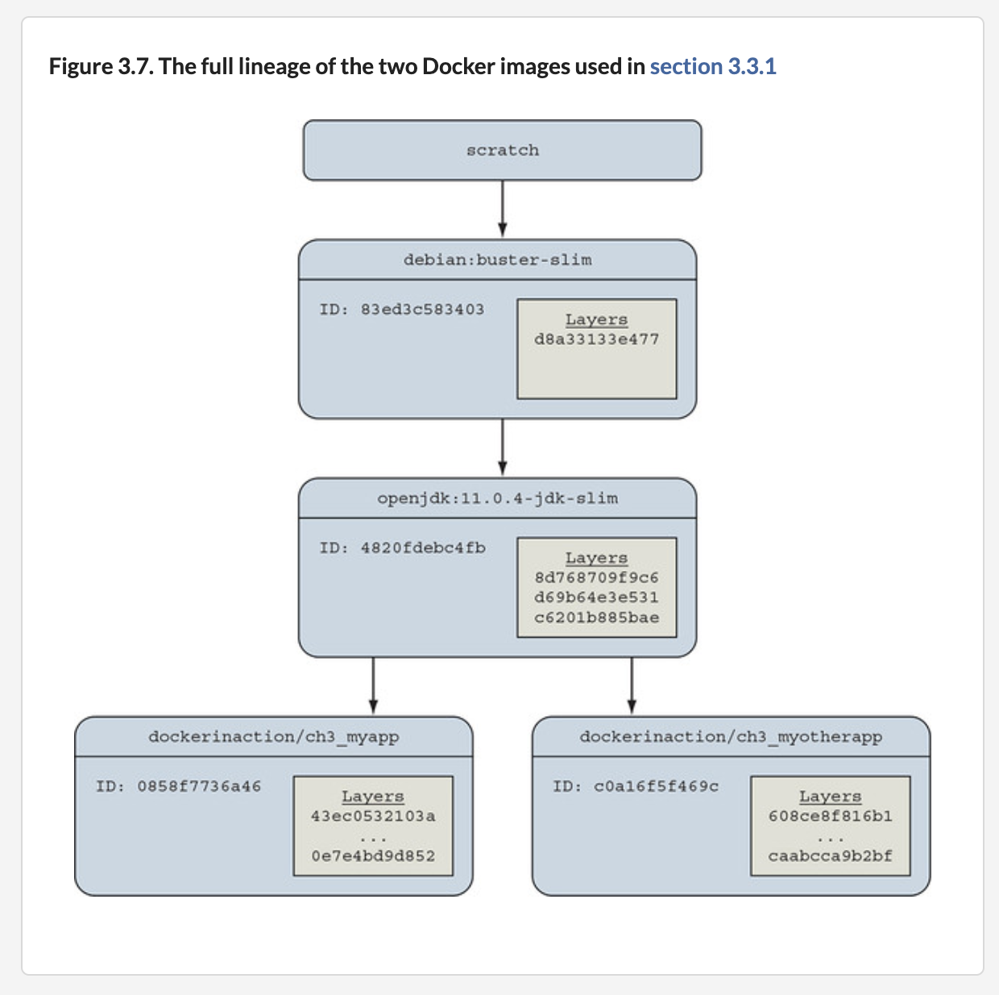</img>

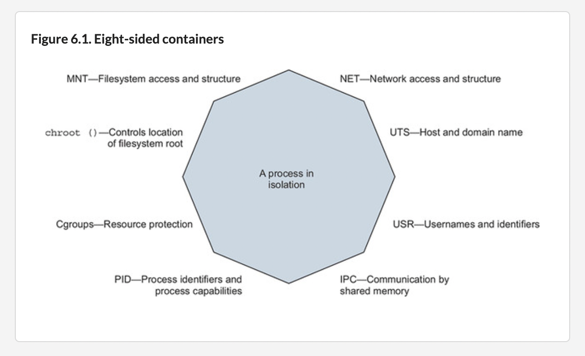</img>

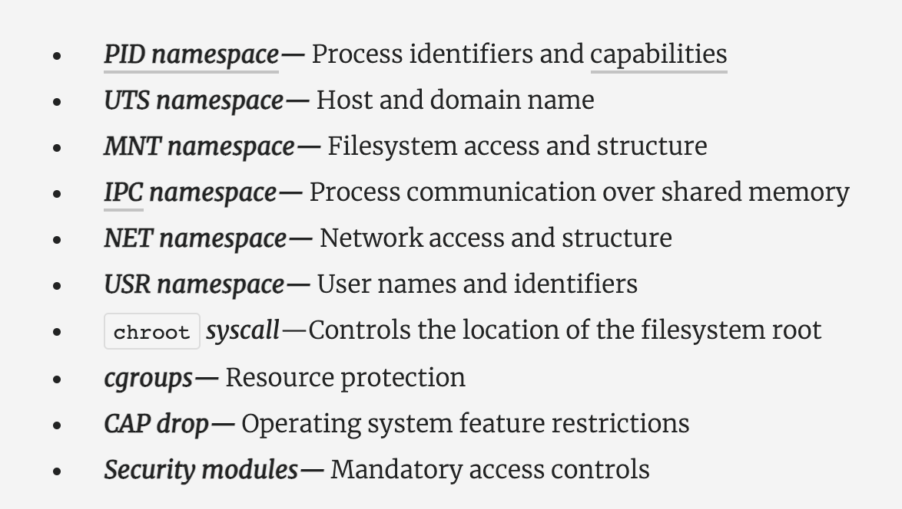</img>

# Références

https://design.jboss.org/redhatdeveloper/marketing/docker_cheatsheet/cheatsheet/images/docker_cheatsheet_r3v2.pdf

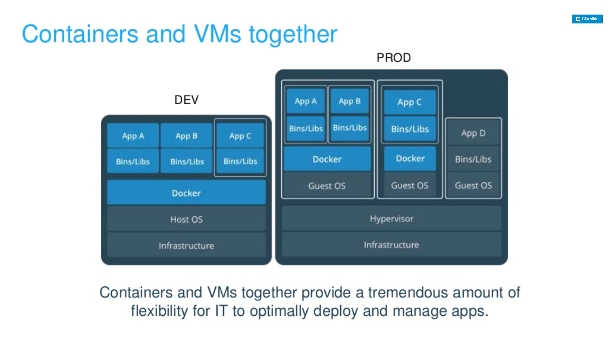</img>

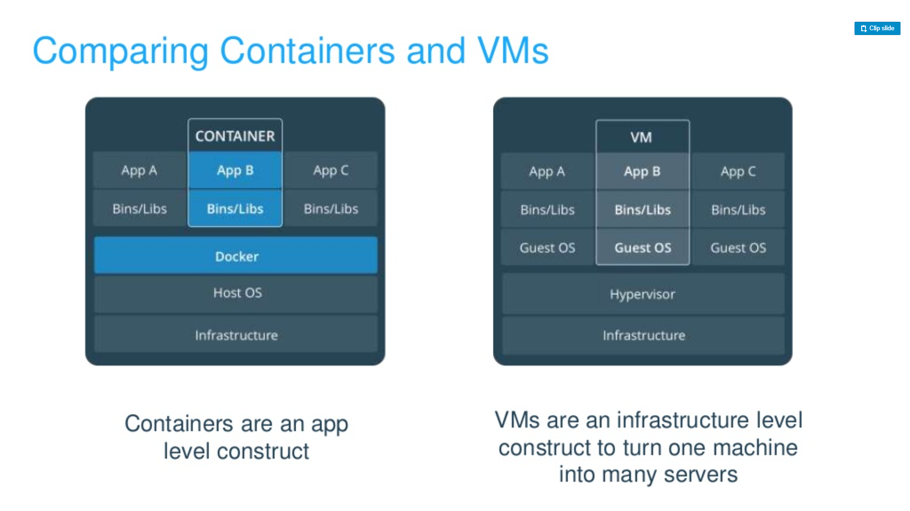</img>

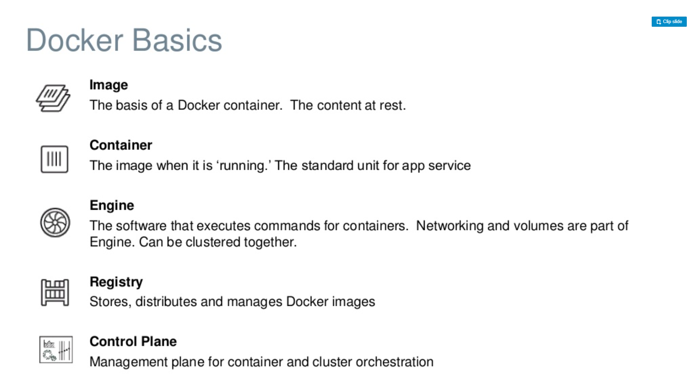</img>

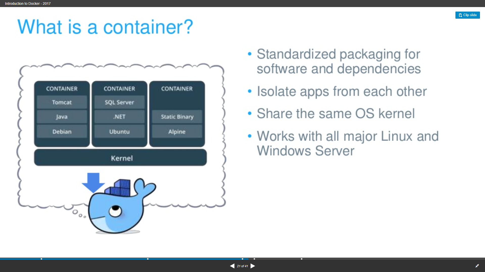</img>

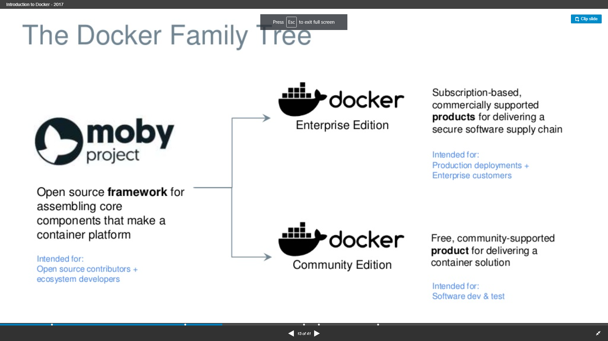</img>

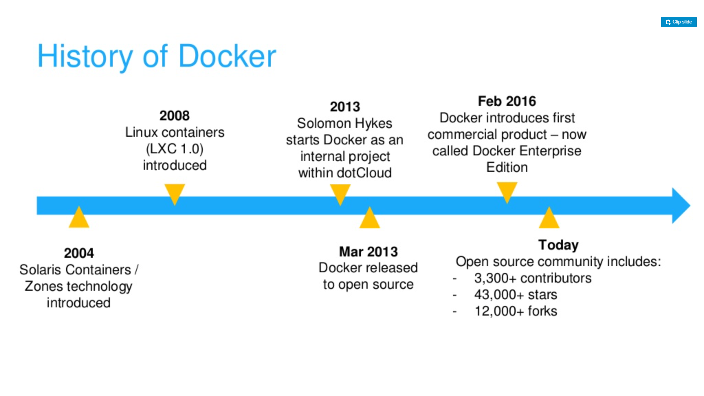</img>

[sergey.kirgizov🐱u-bourgogne.fr](https://kirgizov.link/teaching/esirem/advanced-information-systems-2019/CM-7-clouds-containers.pdf)
