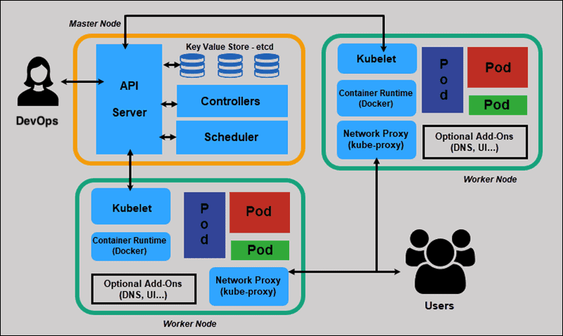

# :wheel_of_dharma: Kubernetes




:gear: :ice_cube: Kube Config - Configuration de grappes

 </img>

- [ ] Identifier les grappes

```
k config get-clusters
```
```yaml
NAME
kind-k8s
kubernetes
```

- [ ] Identifier les contextes (:star: signifie que la grappe `kubernetes` est sélectionée)

```
k config get-contexts
```
```yaml
CURRENT   NAME                          CLUSTER     AUTHINFO          NAMESPACE
*         kubernetes-admin@kubernetes   kubernetes  kubernetes-admin   
```

- [ ] regrouper plusieurs configurations dans un seul fichier `~/.kube/config`

:bulb: La variable d'environnement `KUBECONFIG` permet de regrouper les grappes ensemble

```
KUBECONFIG=~/.kube/config~kind:~/.kube/config~orion \
    kubectl config view --flatten > ~/.kube/config
```


:knot: Noeuds

 </img>

```
 k get no
```
```yaml
NAME         STATUS   ROLES           AGE   VERSION
bellatrix    Ready    <none>          43h   v1.26.3
betelgeuse   Ready    control-plane   43h   v1.26.3
```

:factory: Charge de travail (Workloads)


 </img>
